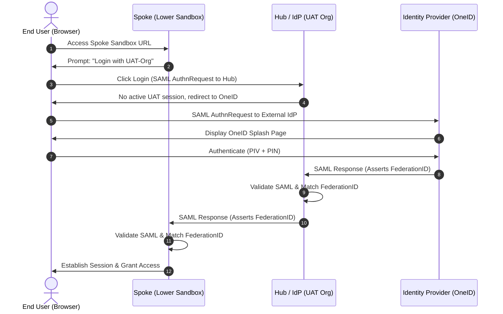
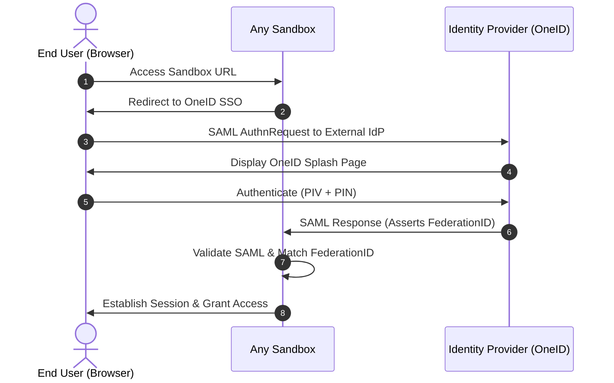

# Salesforce SSO Hub and Spoke Architecture

## 1. Executive Summary
This document outlines the architecture, process flows, and certificate management strategy for a Salesforce Single Sign-On (SSO) Hub and Spoke model. In this setup, lower-level Service Provider (SP) sandboxes (the "Spokes") use a UAT Org as their Identity Provider (the "Hub"). The UAT Org, in turn, delegates authentication to the enterprise Identity Provider (OneID) using PIV card authentication.

## 2. Architecture Overview
The architecture relies on an SSO chaining mechanism:
* **External IdP (OneID):** The ultimate source of truth for user identities, authenticating users via PIV cards.
* **Hub (UAT Org):** Acts as a Service Provider to OneID, and simultaneously as an Identity Provider (IdP) to the lower-level sandboxes. 
* **Spokes (Lower Sandboxes):** Act as Service Providers to the UAT Org.

**Identity Matching:** The architecture relies on the `FederationIdentifier` field on the Salesforce User record. For the end-to-end flow to succeed, the FederationID must match exactly across OneID, the UAT Org, and the Spoke Sandbox.

---

## 3. Hub & Spoke Process Flow

### 3.1. Step-by-Step Flow
1.  **Initiation:** The user attempts to access a lower-level sandbox (SP).
2.  **SP Redirection:** The user is presented with the Salesforce login screen and clicks "Login with UAT-Org".
3.  **Hub Delegation:** The SP sandbox generates a SAML AuthnRequest and redirects the user to the UAT Org.
4.  **IdP Redirection:** Because the user does not have an active session in UAT, the UAT Org immediately redirects the user to the OneID SSO splash page.
5.  **Authentication:** The user inserts their PIV card and enters their PIN on the OneID splash page.
6.  **First Assertion (OneID to UAT):** OneID successfully authenticates the user and POSTs a SAML Response to the UAT Org, asserting the user's Federation ID.
7.  **Hub Authentication:** The UAT Org validates the SAML Response, finds the matching User record via Federation ID, and creates a session.
8.  **Second Assertion (UAT to SP):** Acting as the IdP, the UAT Org immediately generates a new SAML Response asserting the Federation ID, and POSTs it back to the originating SP sandbox.
9.  **SP Authentication:** The SP sandbox validates the response, finds the matching User, and logs the user in.

### 3.2. Hub & Spoke Sequence Diagram

---

## 4. Architectural Comparison: Hub & Spoke vs. Direct SSO

In a "Direct SSO" model, every single Salesforce sandbox is configured with a direct SAML integration to OneID, bypassing UAT as a middleman. 

### 4.1. Direct SSO Sequence Diagram

### 4.2. Comparison Analysis

| Feature | Hub & Spoke (Current) | Direct SSO (Every Sandbox) |
| :--- | :--- | :--- |
| **User Experience** | Slightly slower (2 chained SAML redirects). | Faster (1 direct SAML redirect). |
| **OneID Team Dependency** | **Low:** OneID team only manages UAT and Prod connections. | **High:** OneID team must configure a new relying party for *every* sandbox. |
| **Sandbox Refresh Overhead** | **Low:** Refreshed sandboxes just need their Single Sign-On Settings pointed back to UAT. No OneID ticket needed. | **High:** Sandbox refresh breaks the SSO ACS URL. Requires OneID team to update metadata on their end. |
| **UAT Org Dependency** | **High:** If UAT is down or undergoing maintenance, lower sandboxes cannot log in via SSO. | **Low:** Sandboxes are independent. UAT downtime does not affect Dev sandbox logins. |
| **Configuration in SFDC** | Requires UAT to act as Identity Provider with Connected Apps for each lower sandbox. | Standard Single Sign-On setup in each sandbox. |

**Architectural Recommendation:** The **Hub & Spoke model** is highly recommended for large enterprise environments using strict IdPs like OneID. Getting external IT identity teams to update IdP configurations for every sandbox creation/refresh is notoriously slow. Using UAT as a Hub shifts the control back to the Salesforce architecture team, dramatically improving agility.

---

## 5. Certificate Management Strategy

### 5.1. Can we use the same certificate in all sandboxes?
**Yes, you can.** From a technical perspective, the SP (lower sandboxes) uses a certificate to *sign* the SAML AuthnRequest sent to the IdP (UAT), and the IdP uses it to verify the signature. 

### 5.2. Proposed Certificate Architecture
To minimize the overhead of maintaining and renewing multiple certificates across dozens of sandboxes, use the following tiered approach:

1.  **The "Spoke Request" Certificate (Shared):** 
    * Create a single, long-lived (e.g., 10-year expiration) Self-Signed Certificate in Salesforce.
    * Deploy this exact certificate to all lower-level sandboxes (Spokes). 
    * Configure the SSO settings in the Spoke sandboxes to use this certificate to sign SAML requests.
    * In the UAT Org (Hub), configure the Connected Apps for all the Spoke sandboxes to use this one shared certificate for signature verification.
    * *Why this is safe:* These are non-production environments. Sharing a request-signing cert among internal lower sandboxes poses a very low security risk while saving countless hours of maintenance.

2.  **The "Hub Response" Certificate (Isolated):**
    * The UAT Org requires its own certificate to *sign the SAML Response* it sends down to the Spoke sandboxes.
    * Keep this certificate distinct from the shared Spoke certificate. 
    * When a Spoke sandbox is refreshed, you simply load this UAT IdP certificate into the Spoke's Single Sign-On settings.

3.  **The "OneID Connection" Certificate (Strict):**
    * The certificate used by UAT to connect to OneID must be strictly maintained according to enterprise security policies (often requiring a CA-Signed certificate with 1-2 year expirations).
    * *Benefit of Hub & Spoke:* You only have to renew this certificate in **ONE** place (UAT) instead of every single developer sandbox.

### 5.3. Summary of Best Practice for Sandbox Refreshes
To streamline sandbox creation and refreshes where some developers might be missing:
1.  Automate a post-refresh script (Apex or Salesforce CLI) that re-establishes the SSO settings using the shared certificate.
2.  Ensure developer User records are provisioned with the correct `FederationIdentifier` via a post-copy sandbox script or a JIT (Just-in-Time) provisioning handler if configured, so developers can log in immediately post-refresh without manual intervention.